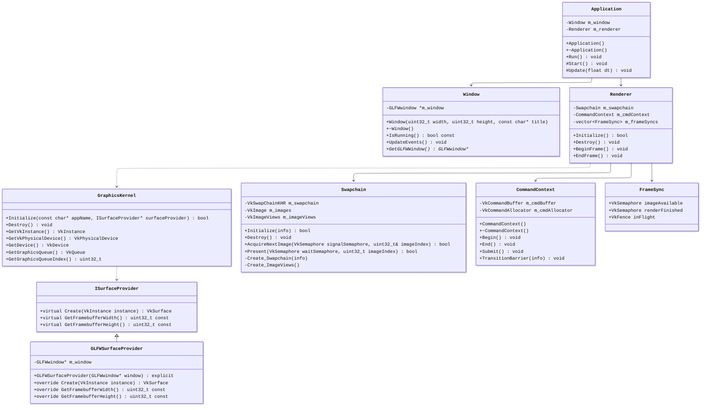

# KADOEngine

## 現段階のクラス設計図

```mermaid
---
config:
  theme: mc
  look: neo
  fontFamily: '''Source Code Pro Variable'', monospace'
  themeVariables:
    fontFamily: '''Source Code Pro Variable'', monospace'
  layout: elk
---
classDiagram
    Application --> Window
    Application --> Renderer
    Renderer ..> GraphicsKernel
    Renderer --> Swapchain
    Renderer --> CommandContext
    Renderer --> FrameSync
    ISurfaceProvider <|-- GLFWSurfaceProvider
    GraphicsKernel ..> ISurfaceProvider

    class Application{
        +Application()
        +~Application()
        +Run() void
        #Start() void
        #Update(float dt) void
        -Window m_window
        -Renderer m_renderer
    }

    class Window{
        +Window(uint32_t width, uint32_t height, const char* title)
        +~Window()
        +IsRunning() bool const
        +UpdateEvents() void
        +GetGLFWWindow() GLFWwindow**
        -GLFWwindow *m_window
    }

    class FrameSync {
        +VkSemaphore imageAvailable
        +VkSemaphore renderFinished
        +VkFence inFlight
    }

    class Renderer{
        +Initialize() bool
        +Destroy() void
        +BeginFrame() void
        +EndFrame() void
        -Swapchain m_swapchain
        -CommandContext m_cmdContext
        -vector~FrameSync~ m_frameSyncs
    }

    class GraphicsKernel{
        +Initialize(const char* appName, ISurfaceProvider* surfaceProvider) bool
        +Destroy() void
        +GetVkInstance() VkInstance
        +GetVkPhysicalDevice() VkPhysicalDevice
        +GetDevice() VkDevice
        +GetGraphicsQueue() VkQueue
        +GetGraphicsQueueIndex() uint32_t
    }

    class Swapchain{
        +Initialize(info) bool
        +Destroy() void
        +AcquireNextImage(VkSemaphore signalSemaphore, uint32_t& imageIndex) bool
        +Present(VkSemaphore waitSemaphore, uint32_t imageIndex) bool
        -VkSwapChainKHR m_swapchain
        -VkImage m_images
        -VkImageViews m_imageViews
        -Create_Swapchain(info)
        -Create_ImageViews()
    }

    class CommandContext{
        +CommandContext()
        +~CommandContext()
        +Begin() void
        +End() void
        +Submit() void
        +TransitionBarrier(info) void
        -VkCommandBuffer m_cmdBuffer
        -VkCommandAllocator m_cmdAllocator
    }

    class ISurfaceProvider{
        +virtual Create(VkInstance instance) VkSurface
        +virtual GetFramebufferWidth() uint32_t const
        +virtual GetFramebufferHeight() uint32_t const 
    }

    class GLFWSurfaceProvider{
        +GLFWSurfaceProvider(GLFWwindow* window) explicit
        +override Create(VkInstance instance) VkSurface
        +override GetFramebufferWidth() uint32_t const
        +override GetFramebufferHeight() uint32_t const 
        -GLFWwindow* m_window
    }
```